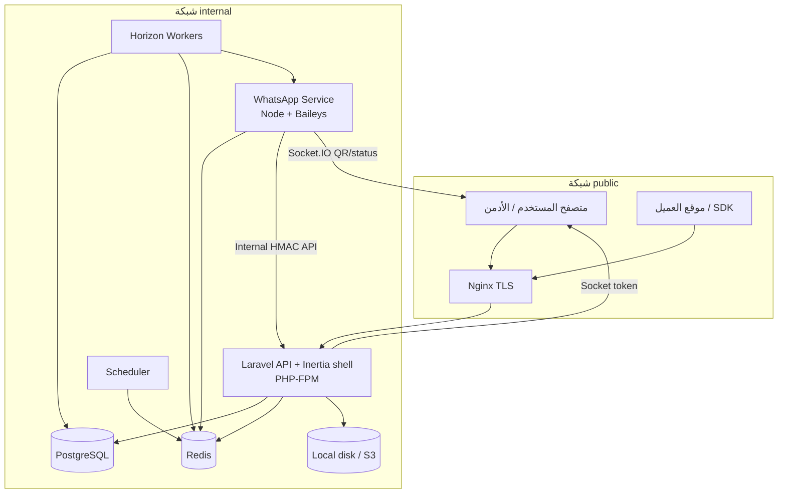
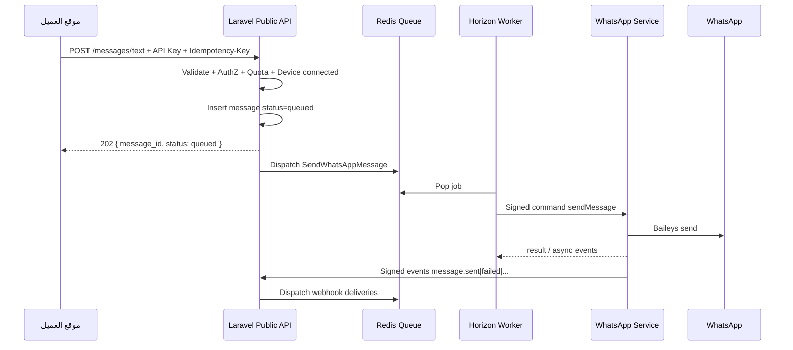
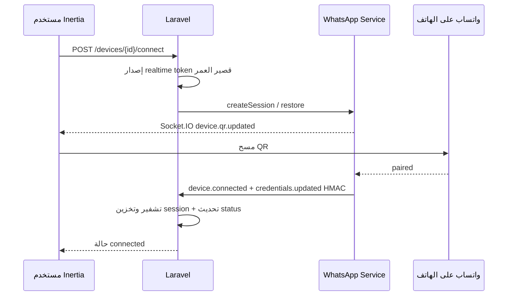

# البنية المعمارية — WhatsApp API SaaS

## 1. نظرة عامة

نظام **Modular Monolith** على Laravel مع واجهة Inertia/React داخل نفس التطبيق، وخدمة **WhatsApp Service** مستقلة (Node.js + TypeScript) تتحدث عبر عقود داخلية موقعة. لا Microservices إضافية في v1.



## 2. قرارات معمارية إلزامية

| القرار | التفصيل |
|--------|---------|
| Frontend | React + TypeScript + Inertia داخل `apps/platform/resources/js`؛ Vite؛ لا Next.js |
| API-first | منطق الأعمال في Actions/Services؛ Inertia و`/api/v1` يستهلكان نفس الطبقة |
| Queues | كل إرسال واتساب عبر Redis Queue؛ لا إرسال في request HTTP |
| Sessions | Baileys فقط في WhatsApp Service؛ credentials مشفّرة في DB عبر Laravel |
| Tenancy | Shared DB/schema + `tenant_id`؛ لا subdomain tenancy في v1 |
| IDs | bigint داخلي + ULID عام؛ Public API يعرض ULID فقط |
| Octane | غير مستخدم في v1؛ PHP-FPM + Nginx |

## 3. طبقات Laravel

```text
HTTP (Controllers / Form Requests)
  → Application Actions / DTOs
    → Domain Services / Policies / Events
      → Eloquent Models / Repositories / Queries
        → Jobs / External Adapters (OTP, Storage, WhatsApp Client)
```

### Domains

```text
Identity | Administration | Tenancy | Plans | Subscriptions | Billing
Devices | ApiKeys | Messaging | Webhooks | Usage | Support
Notifications | Audit
```

قواعد:

- لا business logic ثقيل في Controllers أو Models أو React pages.
- Policies + tenant scopes على الخادم دائمًا.
- استجابات موحّدة `{ success, data|error, meta.request_id }`.

## 4. تدفق الإرسال (Happy path)



## 5. تدفق ربط الجهاز (QR)



## 6. الشبكات والحاويات

| خدمة | شبكة | منفذ عام؟ |
|------|------|-----------|
| nginx | public + internal | نعم (80/443) |
| api (php-fpm) | internal | لا |
| horizon | internal | لا |
| scheduler | internal | لا |
| whatsapp-service | internal | لا (Socket عبر Nginx proxy مقيّد) |
| postgres | internal | لا في prod |
| redis | internal | لا في prod |
| vite | internal | تطوير فقط |

Socket.IO يُمرَّر عبر Nginx بمسار مصادق/مقيّد؛ الخدمة نفسها لا تُنشر مباشرة للعامة.

## 7. التخزين والأسرار

- **PostgreSQL:** مصدر الحقيقة للبيانات التجارية والحالة.
- **Redis:** queues, cache, locks, rate counters (مع reconciliation).
- **Local disk:** وسائط (`storage/app/private`)، إثباتات دفع، نسخ احتياطية؛ اختياري S3 في الإنتاج.
- **KMS/ENV:** `APP_KEY` + `SESSION_MASTER_KEY` خارج DB؛ envelope encryption لإصدارات المفاتيح.
- لا أسرار في Git أو Dockerfile أو compose بدون env.

## 8. Observability

- Structured JSON logs + `request_id` / `tenant_ulid` (بدون أسرار/OTP/محتوى جلسات).
- Health: Laravel `/up`, `/api/v1/health`؛ WA `/health/live`, `/health/ready`.
- Horizon dashboard داخلي محمي.
- Sentry-ready (DSN عبر env).

## 9. مسارات التوسع المستقبلية (بدون تنفيذ الآن)

- عدة workers لـ WhatsApp مع sticky `worker_id`.
- Cloud API provider بدل/إلى جانب Baileys.
- OAuth2 للموبايل.
- Laravel Octane.
- Kubernetes عند الحاجة التشغيلية.
