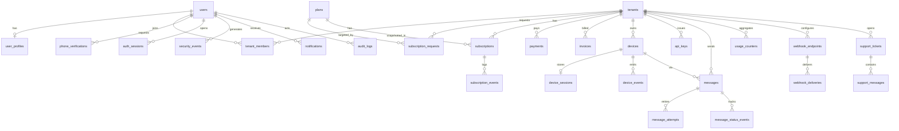

# مخطط قاعدة البيانات — WhatsApp API SaaS

## قرارات عامة

- PostgreSQL، timestamps UTC (`timestamptz`).
- مفتاح داخلي `bigint` + `ulid char(26)` عام فريد.
- Soft deletes للبيانات التجارية حيث يناسب (`users`, `tenants`, `plans`, `devices`, `webhook_endpoints`).
- `tenant_id` على جداول العميل؛ العزل عبر فلترة الاستعلامات الصريحة وPolicies، وليس Global Scope عام.
- Foreign keys + indexes + check constraints + partial unique indexes.
- لا تخزين API key خام أو OTP خام أو session credentials غير مشفّرة.

## ERD أولي

## الجداول حسب المجال

### Identity / Tenancy

| جدول | ملاحظات فهرسة |
|------|----------------|
| `users` | unique `ulid`, `phone_e164`; index `status` |
| `user_profiles` | unique `user_id`; unique nullable `email` |
| `tenants` | unique `ulid`, `slug`; FK `owner_user_id` |
| `tenant_members` | unique `(tenant_id,user_id)` |
| `phone_verifications` | index `(phone_e164,purpose,expires_at)` |
| `auth_sessions` | index `(user_id,revoked_at)`; `token_family_id` |
| `security_events` | index `(type,created_at)`, `(tenant_id,created_at)` |

### Plans / Subscriptions / Billing

| جدول | ملاحظات |
|------|---------|
| `plans` | unique `slug`; soft delete |
| `subscription_requests` | index `(status,created_at)`, `(tenant_id,status)` |
| `subscriptions` | partial unique: اشتراك `active` واحد لكل tenant؛ snapshot حدود الخطة |
| `subscription_events` | append-only |
| `payments` | index `(tenant_id,status)` |
| `invoices` | unique `invoice_number` |

### Devices

| جدول | ملاحظات |
|------|---------|
| `devices` | index `(tenant_id,status)`; unique فعال للرقم داخل tenant عند الاتصال |
| `device_sessions` | 1:1؛ `encrypted_data` + key version + nonce/tag |
| `device_events` | timeline للتشخيص |

### API Keys / Messaging / Usage

| جدول | ملاحظات |
|------|---------|
| `api_keys` | `secret_hash` للمصادقة و`secret_encrypted` لإعادة عرض مفتاح تكامل الجهاز للمستخدم المصرّح |
| `messages` | unique `(tenant_id,idempotency_key)` حيث لا null؛ indexes الحالة/الجهاز/الزمن |
| `message_attempts` | تاريخ المحاولات |
| `message_status_events` | timeline الحالة |
| `usage_counters` | unique حسب period/tenant/device |

### Webhooks / Support / Audit

| جدول | ملاحظات |
|------|---------|
| `webhook_endpoints` | soft delete؛ secret مشفّر للتوقيع |
| `webhook_deliveries` | index `(status,next_attempt_at)` |
| `notifications` | per user |
| `support_tickets` / `support_messages` | مرفق آمن عبر S3 |
| `audit_logs` | immutable من UI؛ indexes actor/tenant/action |
| `system_settings` | غير سرية فقط |

## حالات أساسية (Enums منطقية)

- **User:** `pending_phone_verification` → `pending_approval` → `active` | `rejected` | `suspended` | `disabled`
- **Subscription:** `scheduled` | `active` | `expiring` | `expired` | `suspended` | `cancelled`
- **Device:** `creating` | `qr_required` | `connecting` | `connected` | `disconnected` | `logged_out` | `suspended` | `error` | `deleted`
- **Message:** `queued` | `processing` | `sent` | `delivered` | `read` | `failed` | `cancelled` | `expired`

## Retention (أولي)

| البيانات | السياسة المقترحة v1 |
|----------|---------------------|
| OTP rows | حذف بعد 7 أيام من الاستهلاك/الانتهاء |
| message content | قابل للضبط؛ افتراضي metadata + فترة محدودة للنص إن وُجد |
| webhook payloads | 30–90 يومًا ثم تنقية |
| audit/security events | احتفاظ أطول (سنة+) |
| device sessions | تُحذف/تُبطل عند logout أو حذف الجهاز |
| backups | دورة موثّقة في `docs/backup-restore.md` (مرحلة 8) |

## ملاحظات ترحيل

- Migrations تراكمية ومنفصلة لكل مجال.
- لا تشغيل migrate من كل replica؛ أمر deploy منفصل.
- أي تغيير على Public API يبقى ضمن `/api/v1` متوافقًا قدر الإمكان.
