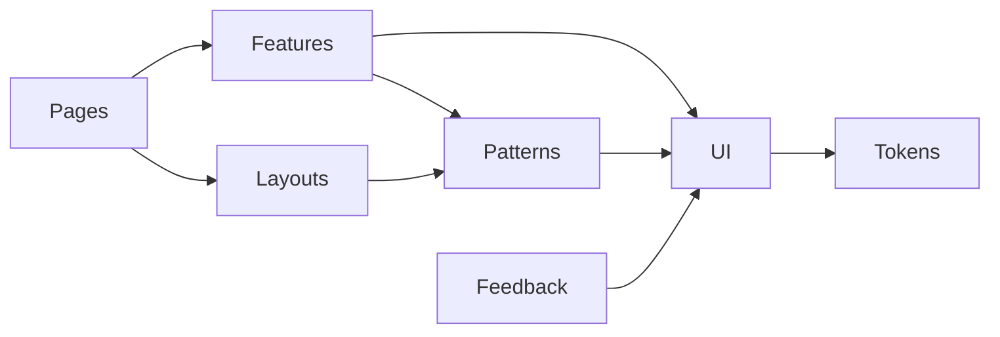

# Wireframes (Phase 0)

Text / Mermaid only — no full pixel mockups yet.

## 1. Tenant AppShell (desktop RTL)

```
┌──────────────┬────────────────────────────────────────────┐
│ Sidebar 272  │ Topbar 68 (sticky, surface + border)       │
│ [Logo/Brand] ├────────────────────────────────────────────┤
│ Nav groups   │ Breadcrumb                                 │
│  · نظرة عامة │ PageHeader + PageActions                   │
│  · الأجهزة   │                                            │
│  · …         │ Content (max 1600 / 1200)                  │
│              │                                            │
│ Quota card   │                                            │
│ User menu    │                                            │
└──────────────┴────────────────────────────────────────────┘
```

Mobile: Topbar (logo · title · bell · menu) → Sheet from right; optional sticky bottom CTA.

## 2. Admin shell difference

Same shell + thin **Aubergine** top strip: «لوحة الإدارة» · optional env badge (staging only).

## 3. Auth (desktop split)

```
┌─────────────────────┬─────────────────────┐
│ Brand / trust copy  │ Form ≤440px         │
│ Deep teal soft bg   │ Title + fields      │
│ No stock phones     │ Primary CTA         │
└─────────────────────┴─────────────────────┘
```

Mobile: form only. Register: stepper (بيانات → OTP → انتظار الموافقة).

## 4. Tenant Dashboard

```
[ExpirationNotice?]
[PageHeader: مرحبًا · إضافة جهاز]
[Stat×4]
[Chart 7/30d | Device health list]
[Recent activity | Quick-start checklist]
```

Empty new accounts → onboarding EmptyState, not blank charts.

## 5. Devices list / detail

List: filters (الكل / متصل / يحتاج ربط / مفصول / موقوف) + QuotaIndicator + table/cards.  
Detail: status header → tabs (نظرة عامة · نشاط · رسائل · إعدادات) → DangerZone last.  
QR: Dialog, white QR, countdown, states generating→…→connected|expired|error; no overlays on QR pixels.

## 6. Approvals (Admin master/detail)

```
┌────────────┬──────────────────────────┐
│ Queue list │ Detail + timeline        │
│ (RTL start)│ Proof · notes            │
│            │ [رفض] [موافقة] sticky    │
└────────────┴──────────────────────────┘
```

Reject requires reason; approve confirms dates/limits.

## 7. Secret reveal (API key / webhook)

Modal: non-dismissible until “تم الحفظ” checkbox/confirm · CopyButton · warning · `dir=ltr` secret.

## 8. Component hierarchy (implementation)



## 9. Docs layout (later)

Inner sidebar nav · TOC · search · code tabs LTR + Arabic explanation RTL.
